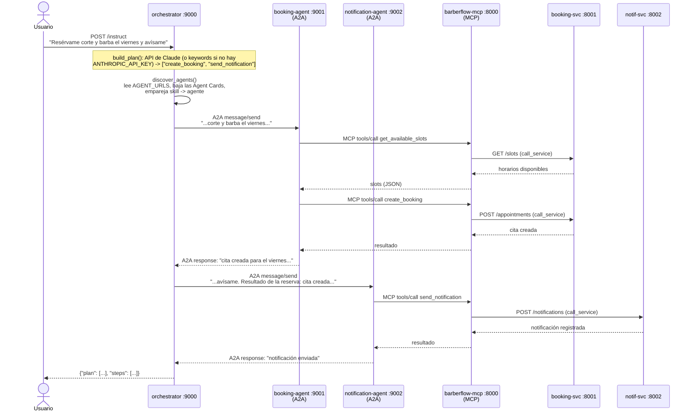

# BarberFlow — Plataforma de reservas para barbería/peluquería

Sistema de reservas de citas de barbería construido con arquitectura de microservicios:
tres servicios independientes con base de datos propia, service registry con Consul,
un MCP Server para operar el sistema con agentes de IA, y una red de agentes A2A.

> Proyecto del curso **Arquitectura de Componentes y Microservicios** — Universidad Galileo, FISICC.
> El backlog de implementación está en [`docs/BACKLOG.md`](docs/BACKLOG.md).

## Componentes

| Servicio | Puerto | Qué hace |
|---|---|---|
| `users-svc` | 8003 | Registro y autenticación de usuarios (JWT) |
| `booking-svc` | 8001 | Gestión de citas, servicios de barbería y horarios |
| `notif-svc` | 8002 | Envío e historial de notificaciones |
| `barberflow-mcp` | 8000 | Expone BarberFlow a agentes de IA vía MCP |
| `consul` | 8500 | Registro y descubrimiento de servicios |
| `orchestrator` / `booking-agent` / `notification-agent` | 9000–9002 | Red de agentes A2A |

## Cómo correr

```bash
cp .env.example .env    # completar los valores
docker compose up --build
```

## Gestión de secretos y rotación de credenciales (tarea 38)

### Dónde viven los secretos

Todos los secretos (contraseñas de Postgres, `JWT_SECRET`, `DEMO_USER_PASSWORD`,
`ANTHROPIC_API_KEY`) se leen de variables de entorno, nunca están escritos en el
código ni en `docker-compose.yml`. `.env` está en `.gitignore`; lo único que se
commitea es `.env.example` con placeholders (`cambiar`). Ver la auditoría de la
tarea 42 para la verificación de que ningún secreto real llegó al historial de git.

Cada base de datos tiene dos roles (patrón *least privilege*, tarea 14):

- Un **superusuario** (`*_DB_SUPERUSER` / `*_DB_SUPERPASSWORD`) que solo usa el
  entrypoint de Postgres para inicializar el esquema.
- Un **rol de aplicación** (`*_APP_USER` / `*_APP_PASSWORD`) con permisos mínimos
  (`CONNECT`, `USAGE` sobre `public`, DML sobre las tablas — nada de `CREATE`,
  `ALTER` ni `DROP`), creado por `services/<svc>/db/02-init.sh` a partir de
  `APP_DB_USER`/`APP_DB_PASSWORD`. Es este rol el que usa el propio servicio en su
  `DATABASE_URL`, y el que hay que rotar periódicamente o ante una fuga.

### Por qué el procedimiento "obvio" SÍ tiene downtime (medido)

La nota original del backlog para esta tarea decía: crear un rol nuevo con los
mismos grants, cambiar el `DATABASE_URL` del servicio, reiniciarlo con
`docker compose up -d --no-deps <svc>` y luego borrar el rol viejo. Se probó
ese procedimiento tal cual (una sola instancia de `booking-svc`, contra Postgres
real, con un poller externo golpeando `/readyz` cada ~65 ms) y **sí hay una
ventana real sin servicio**: al matar el proceso viejo y levantar el nuevo con
el rol rotado, el poller registró 15 peticiones fallidas seguidas antes de que
el servicio volviera a responder — **≈0.99 s de corte real** (última respuesta
`200` antes del corte → primera `200` después: 1.07 s). Es el resultado
esperado de reemplazar la única réplica de un servicio en el sitio: por un
instante nadie escucha en ese puerto. Documentarlo así, en vez de afirmar
"cero downtime" sin comprobarlo, es el punto de esta tarea.

### El procedimiento que sí cumple "sin que caiga ningún servicio" (probado)

BarberFlow ya tiene las dos piezas necesarias para una rotación real sin caída:
Consul como registro de servicios (varias instancias pueden registrarse bajo el
mismo `Name`) y `shared/resilience.call_service`, que en cada llamada (y en cada
reintento) vuelve a resolver la instancia vía `consul.discover()` — que a su vez
reparte con `random.choice` entre **todas** las instancias sanas. Eso significa
que mientras haya *al menos una* instancia sana de un servicio, sus llamadores
nunca ven un fallo, aunque la instancia que se está rotando esté cayendo en ese
mismo instante. El procedimiento es un rolling/blue-green de un servicio a la vez:

1. Crear el rol nuevo con los mismos grants que el viejo (mismo SQL que corre
   `02-init.sh`, contra la base ya existente):
   ```sql
   CREATE ROLE booking_app_v2 LOGIN PASSWORD '<password-nueva>';
   GRANT USAGE ON SCHEMA public TO booking_app_v2;
   GRANT SELECT, INSERT, UPDATE, DELETE ON ALL TABLES IN SCHEMA public TO booking_app_v2;
   GRANT USAGE, SELECT ON ALL SEQUENCES IN SCHEMA public TO booking_app_v2;
   ```
2. Levantar **una segunda instancia** del mismo servicio, con el rol nuevo en su
   `DATABASE_URL`, sin tocar la instancia original (que sigue sirviendo con el
   rol viejo):
   ```bash
   docker compose run -d --name barberflow-booking-svc-rotate --no-deps \
     -p 8011:8001 \
     -e DATABASE_URL="postgresql://booking_app_v2:<password-nueva>@booking-db:5432/${BOOKING_DB_NAME}" \
     booking-svc
   ```
   Ambos contenedores se registran en Consul bajo el mismo `Name=booking-svc`
   (cada uno con su propio `service_id`, ver `shared/consul.register`), así que
   apenas el health check del nuevo pasa, Consul lista **dos** instancias sanas.
3. Confirmar que la instancia nueva quedó sana (`GET /readyz` y una consulta real,
   p. ej. `GET /services`, contra su puerto publicado) antes de tocar nada más.
4. Recrear la instancia original con el rol nuevo:
   `docker compose up -d --no-deps booking-svc` (con `BOOKING_APP_USER`/
   `BOOKING_APP_PASSWORD` ya actualizados en `.env` al rol nuevo). Esta instancia
   sí pasa por el mismo corte de ~1 s medido arriba — pero durante ese segundo la
   instancia temporal del paso 2 sigue sana y registrada, así que **no hay ningún
   instante con cero instancias sanas**.
5. Una vez que la instancia original vuelve a responder con el rol nuevo, bajar
   la instancia temporal (`docker compose rm -fs barberflow-booking-svc-rotate`).
6. Recién ahora borrar el rol viejo (`DROP OWNED BY booking_app; DROP ROLE
   booking_app;` tras reasignar lo que sea dueño con `REASSIGN OWNED`).

**Evidencia real de que esto funciona:** se corrió este procedimiento completo
contra Postgres real (dos instancias de `booking-svc` simultáneas, una con el
rol viejo y otra con un rol nuevo, ambas registradas en el mismo service registry),
con un llamador que usó el **mismo** `shared.resilience.call_service` que usan
los demás servicios de BarberFlow entre sí — 400 llamadas reales a
`GET /services` cada 50 ms, sin parar, mientras se mataba la instancia con el
rol viejo y se borraba ese rol a mitad del test:

```
total=400 fails=0
```

Cero fallos en las 400 llamadas. La caída de ~1 s de una instancia sola sigue
ahí (es real y está medida arriba), pero como nunca coincide con "cero
instancias sanas", ningún llamador la nota. Eso es lo que pide el "Done cuando"
de la tarea 38: no que una instancia individual nunca tenga un blip, sino que
ningún servicio de BarberFlow se caiga por la rotación.

## Agent-to-Agent: MCP vs. A2A (tarea 39)

BarberFlow usa dos protocolos distintos para IA, y no son intercambiables:
resuelven problemas distintos.

- **MCP (Model Context Protocol)** — `barberflow-mcp` (puerto 8000) — conecta un
  modelo/cliente de IA (Claude Desktop, el propio `orchestrator`) con
  **herramientas**: funciones puntuales con un esquema de entrada/salida
  (`get_available_slots`, `create_booking`, `cancel_booking`, `send_notification`,
  `get_notifications`). Es una relación **cliente ↔ servidor de herramientas**:
  quien habla MCP no tiene "personalidad" ni mantiene una conversación, solo
  expone o invoca funciones.
- **A2A (Agent2Agent)** — `booking-agent` (9001), `notification-agent` (9002) y
  el `orchestrator` (9000) — conecta **agentes** entre sí: cada uno publica una
  *Agent Card* (`/.well-known/agent-card.json`) que anuncia sus *skills* en
  lenguaje natural, y se les habla con un mensaje de texto libre
  (`message/send`), no con una llamada a función tipada. Es una relación
  **agente ↔ agente**: el `orchestrator` no sabe qué hace `create_booking` por
  dentro, solo sabe que `booking-agent` tiene la skill `create_booking` y le
  delega el mensaje completo.

En BarberFlow un agente A2A **es un cliente de MCP**: `booking-agent` y
`notification-agent` no hablan directo con `booking-svc`/`notif-svc` — traducen
el mensaje en lenguaje natural que reciben por A2A a una llamada a una tool de
`barberflow-mcp` (`shared/mcp_client.call_tool`), y esa tool es la que finalmente
llama al microservicio de negocio vía `shared.resilience.call_service`. MCP es
la capa de "acción sobre el sistema"; A2A es la capa de "delegación entre
agentes que deciden qué acción tomar".

### Demo en video (`video_DEMO_mcp.mp4`)

Grabación de ejemplo de una llamada real a `barberflow-mcp` a través de Claude:
desde el cliente de IA (Claude Desktop/Cowork conectado como cliente MCP) se
invocan las tools `get_available_slots` y `create_booking` expuestas por
`barberflow-mcp` (puerto 8000), igual que las usa `booking-agent` en el flujo
A2A de abajo, pero aquí llamadas directo por Claude como cliente de herramientas.

> El archivo pesa ~68 MB (por encima del límite de 100 MB de GitHub para el
> historial, pero pesado igual) y está en `.gitignore`, así que no vive en el
> repo remoto — pídelo aparte si lo necesitas.

### Flujo real de un mensaje



El mismo `x-correlation-id` viaja por las tres capas (A2A, MCP y las llamadas
HTTP internas entre microservicios) — ver [`docs/correlation-id-trace.md`](docs/correlation-id-trace.md)
para una traza real capturada de este flujo con un solo `correlation_id` visible
en los logs de los 6 servicios.

_El resto de este README (arquitectura completa, tabla de servicios, mapeo PDF →
barbería) se completa en la tarea 37 del backlog, a cargo de Estuardo._
